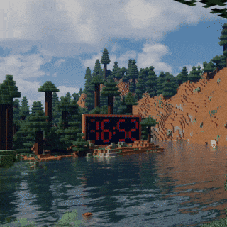

# 🌦️ Minecraft Live Weather Wallpaper



> 🎮 Designed for Wallpaper Engine — not a standard web app

A dynamic Minecraft-style live wallpaper that reacts to real-world weather in real-time using live API data.  
Built as an upgraded, modernized version of the classic Minecraft digital clock concept — now with real weather simulation, smart fallbacks, and immersive UI.

---

## ✨ Features

- 🌍 **Auto Location Detection (IP-based)**  
- 🧠 **Smart Fallback System**
  - Time-based location switching (morning / evening)
  - Weekend vs weekday logic  

- 🌧️ **Rain Intensity Simulation**
  - Drizzle → Light → Moderate → Heavy rain  

- ☁️ **Cloud-Based Background Logic**
  - Clear (<25%) shows sunny environment  

- 🌡️ **Live Weather Data**
  - Temperature  
  - Humidity  
  - Wind speed  
  - UV index  

- 🌦️ **Precipitation Tracking**
  - Rain probability (%)  
  - Actual rainfall (mm)  

- 🕒 **Time-Based Environment**
  - Morning / Afternoon / Evening / Night  

- 🎮 **Minecraft-Style UI**
  - Clean overlay  
  - Dynamic logs  
  - Smooth animations  

- 🖱️ **Manual Location Selector**
  - Long press anywhere to open location menu  

---

## 🖥 Requirements

- [Wallpaper Engine (Steam)](https://store.steampowered.com/app/431960/Wallpaper_Engine/)

---

## ▶️ Setup

Clone or download this repository:
Open Wallpaper Engine
Go to:
My Projects → Create Wallpaper
Select the project folder
Run and enjoy 🚀

⚠️ This project is built specifically for Wallpaper Engine and may not work correctly in a normal browser.

🌍 Location Handling
🟢 Auto Mode
Uses IP-based APIs (ipwho, ipapi)
Detects your city automatically
Displays detected city in UI

⚠️ Auto detection may fail inside Wallpaper Engine due to network/permission limitations

🔁 Smart Fallback Logic

If auto detection fails:

🕘 After 9 AM → Noida
🌆 After 6 PM → Faridabad
📅 Saturday & Sunday → Faridabad
Example Code
```
const hour = new Date().getHours();
const day = new Date().getDay(); // 0 = Sunday

if (day === 0 || day === 6) {
  fetchWeather(28.4333, 77.3167); // Faridabad
} else if (hour >= 18) {
  fetchWeather(28.4333, 77.3167); // Evening → Faridabad
} else {
  fetchWeather(28.57, 77.32); // Day → Noida
}
```
🖱️ Manual Location Selection
Long press anywhere on screen
Location selector will appear
Click any city to switch instantly
🛠 Customization

You can modify:

🌍 Fallback locations
🧠 Time-based logic
📅 Weekend behavior
🌧️ Rain intensity thresholds
☁️ Cloud percentage logic
🎨 UI text & layout
📊 Weather Logic (Important)
🌧️ Rain Detection

Based on:

precip_mm (actual rainfall)
chance_of_rain (%)
Condition	Output
0 mm	No rain
0–1 mm	Drizzle
1–5 mm	Light Rain
5–15 mm	Moderate Rain
15+ mm	Heavy Rain
☁️ Cloud Logic
Cloud %	Visual
< 25%	Clear sky
25–60%	Few clouds
60%+	Cloudy
⚙️ Tech Stack
JavaScript
WeatherAPI
Wallpaper Engine
🚀 Future Improvements
🔊 Rain sound based on intensity
⚡ Lightning & thunder effects
🌫 Fog & atmosphere depth
🎯 GPU-based particle optimization
📌 Notes
Auto detection may not always work due to Wallpaper Engine restrictions
API-based weather may have slight delays
Optimized for performance (low GPU usage)
❤️ Support / Donate

If you like this project, you can support me:

💰 PayPal: 1llekjotsingh@gmail.com
📱 UPI: 8800638800@slc
⭐ Show some love

If this project helped you or you liked it:

👉 Give it a star ⭐ on GitHub
